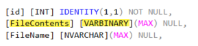

# About

Provides code to read and write images to SQL-Server. Code has been kept simple, for a better view try out the project `SingleFileUploadAndRead` which is .NET Framework classic Windows Forms project with the same methods.

## Sample table structure

## Methods

- `InsertFileSimple` provides code to insert a file into the table defined in TestConsoleApp\DataScripts\dataScript.sql. Pass in the path to a file to insert, returns sucess, the new primary key and an exception object populated on failure.
- `ReadFileFromDatabaseTableSimple`, writes a image to disk by passing in a primary key. Since this is the only actual used method I added a cancellation token to timeout in 1 second which means if you did not first create the database no need to wait for the default timeout of thirty seconds.
- `GetAttachmentsForEvent` get all records into a `DataTable`, of course you can elect to use a `List<T>`.

