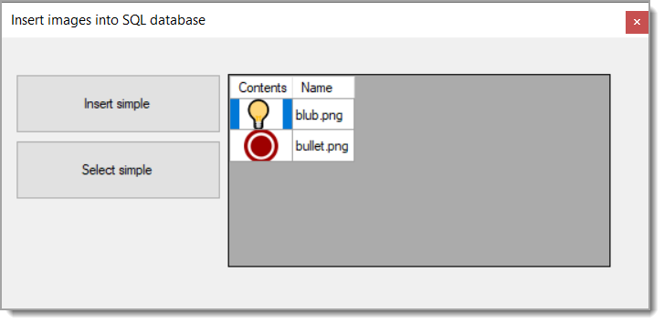

# About

This project has changed from the version in the master branch to show working with images only.

Also, various code improvements in `DataOperations` class.

- Original code read the database connection string from `App.config`, now reads from `appsettings.json` so those who want to copy the code to a .NET Core project can.
- The connection string has `Encrypt=False` for those working with newer versions of the data provider.

