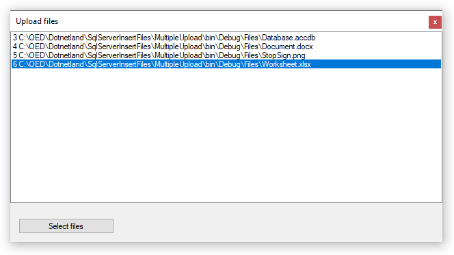

# C# Insert binary files into SQL-Server table

## Introduction
Learn how to store any binary or non-binary file into a SQL-Server database table using C# and SqlClient  classes which is one option while the other option is using FILESTREAM. Which one to use can be a team decision, a DBA decision or dependent on amount and sizes of files. Here the focus will be on storing files in a column within a table.

## Porting from old article

This article is a port from Microsoft TechNet which Karen wrote November 27 2019. Microsoft TechNet is going away thus the reason for this article.

Original code was written in 4.5 and 4.7 framework which still exist, and two new projects have been added using NET8. To write the NET8 versions, new projects were created, old framework code added to the new class project then refactored the code. A console project was added to insert and read back a image file. It does not matter the file type, if a image works so will other file types.

**Author’s opinion**, it depends on how many files will be stored along with file sizes and usage of images. For example, there is a table that represents categories for products with ten rows, one image per row, this is a decent reason for storing images in a database table. Before storing files in a database table read the Stackoverflow post and decide which is best, file system or database storage. 

## Code presented below

None of the NET9 code is shown, once the [repository](https://github.com/karenpayneoregon/SqlServerInsertFiles) is clone examine the code. NET8 code is basically the same as the framework code but better. For example `cmd.Parameters.AddWithValue` has been replaced with `cmd.Parameters.Add` and more refinements.


## Source code

Clone the following GitHub [repository](https://github.com/karenpayneoregon/SqlServerInsertFiles). For the [NET8](https://dotnet.microsoft.com/en-us/download/visual-studio-sdks?cid=getdotnetsdk) core projects, this requires that NET8 is installed and using Microsoft [Visual Studio 2022](https://visualstudio.microsoft.com/downloads/).

## Storing files

Should files be stored in a database or the file system?

For a great discussion, read the following [Stackoverflow post](https://stackoverflow.com/questions/3748/storing-images-in-db-yea-or-nay#3756).


## Column type used for storing files
The column type which will be used is varbinary(MAX) which is best suited for this type of operation.

## Storing a file
Create a class which has a method which accepts the path and filename, the second parameter is either the filename from the first parameter or perhaps a new filename. 

```csharp
public bool InsertFileSimple(string FilePath, string FileName, ref int NewIdentifier)
```

**Step 1**

Read the file content into a byte array which will be used as a value for a command object parameter.

```csharp
byte[] fileByes;
 
using (var stream = new FileStream(FilePath, FileMode.Open, FileAccess.Read))
{
    using (var reader = new BinaryReader(stream))
    {
        fileByes = reader.ReadBytes((int)stream.Length);
    }
}
```

**Step 2**

Create a connection and command object, set the command text and parameters. The SQL INSERT statement differs from conventional SQL in that one parameter is passing a byte array to the query rather than string, numeric, date etc.

```csharp
using (var cn = new SqlConnection() { ConnectionString = Default.ConnectionString })
{
    const string statement = "INSERT INTO Table1 (FileContents,FileName) VALUES (@FileContents,@FileName);" +
                             "SELECT CAST(scope_identity() AS int);";
 
    using (var cmd = new SqlCommand() { Connection = cn, CommandText = statement })
    {
        cmd.Parameters.Add("@FileContents",
            SqlDbType.VarBinary, fileByes.Length).Value = fileByes;
 
        cmd.Parameters.AddWithValue("@FileName", FileName);
 
        try
        {
            cn.Open();
 
            NewIdentifier = Convert.ToInt32(cmd.ExecuteScalar());
            return true;
 
        }
        catch (Exception ex)
        {
            ExceptionMessage = ex.Message;
            return false;
        }
    }
}
```

Note that the SQL is actually two statements separated by a semi-colon. The second query is responsible for returning the new primary key for the newly added record.


**Step 3**

This is actually the start, calling the method above and returning from the method call.

Since InsertFileSimple returns a boolean this indicates success or failure. On success (returning true) identifier variable now contains the new primary key while if the operation failed identifier variable is invalid, check ExceptionMessage property for what happened.

```csharp
var ops = new DataOperations();
var identifier = 0;
var fileName = Path.Combine(AppDomain.CurrentDomain.BaseDirectory, "Dogma1.html");
 
if (ops.InsertFileSimple(fileName, "Dogma1.html", ref identifier))
{
    MessageBox.Show($"Id is {identifier}");
}
else
{
    MessageBox.Show($"Failed: {ops.ExceptionMessage}");
}
```

## Reading and writing to disk

To retrieve a file a SQL SELECT is used passing the primary key. The critical code is shown below, broken out from the method to return bytes and write to disk.

- Get the ordinal index for the column containing byte array to the stored content.
- The blob variable sets up the line of code below to perform the actual read which populates the variable block with the data read via reader.GetBytes.
- Uses a FileStream to write the byte array to a file.

```csharp
var reader = cmd.ExecuteReader();
 
if (reader.HasRows)
{
    reader.Read();
 
    // the blob column
    var fieldOrdinal = reader.GetOrdinal("FileContents");
 
    var blob = new byte[(reader.GetBytes(
        fieldOrdinal, 0,
        null, 0,
        int.MaxValue))];
 
    reader.GetBytes(fieldOrdinal, 0, blob, 0, blob.Length);
 
    using (var fs = new FileStream(fileName, FileMode.Create, FileAccess.Write))
        fs.Write(blob, 0, blob.Length);
 
}
```

Entire method to read from a table and write to a physical file. FileContents is the varbinary column for storing files.

```csharp
public bool ReadFileFromDatabaseTableSimple(int Identifier, string fileName)
{
    using (var cn = new SqlConnection() { ConnectionString = Default.ConnectionString })
    {
        const string statement = "SELECT id, [FileContents], FileName FROM Table1  WHERE id = @id;";
 
        using (var cmd = new SqlCommand() { Connection = cn, CommandText = statement})
        {
            cmd.Parameters.AddWithValue("@id", Identifier);
 
            try
            {
                cn.Open();
 
            var reader = cmd.ExecuteReader();
 
            if (reader.HasRows)
            {
                reader.Read();
 
                // the blob column
                var fieldOrdinal = reader.GetOrdinal("FileContents");
 
                var blob = new byte[(reader.GetBytes(
                    fieldOrdinal, 0,
                    null, 0,
                    int.MaxValue))];
 
                reader.GetBytes(fieldOrdinal, 0, blob, 0, blob.Length);
 
                using (var fs = new FileStream(fileName, FileMode.Create, FileAccess.Write))
                    fs.Write(blob, 0, blob.Length);
 
            }
 
                return true;
 
            }
 
            catch (Exception ex)
            {
                ExceptionMessage = ex.Message;
                return false;
            }
        }
    }
}
```

## Storing more than a single file

Although the code for storing a single file will work for storing many files code can get overly messy fast and error prone.  

:stop_sign: The code sample presented uses inline methods which is not supported in some of the lower .NET Frameworks, if this is the case then extract the inline method to a private method in the same class.

The suggested pattern:

- Wrap the executing code to perform the INSERT with a connection and command.
- Command parameters will be created once and used later. In the single file insert parameters were created with AddWithValue which if used here would mean on each iteration the parameter collection would need to be cleared and then add parameters back in unlike the code below, create each parameter once.


To monitor progress in real time a delegate is used which the caller subscribes too, in this case a ListBox is populated in each iteration performing inserts.



Code behind called in this case from a button click event.

```csharp
using System;
using System.Collections.Generic;
using System.Data;
using System.Data.SqlClient;
using System.IO;
using static MultipleUpload.Properties.Settings;
 
namespace MultipleUpload
{
    public class DataOperations
    {
        public delegate void FileHandler(object sender, InsertFileArgs myArgs);
        public event FileHandler OnLineHandler;
 
        public string ExceptionMessage { get; set; }
 
        /// <summary>
        /// Takes a list of files and inserts them into a table with a delegate
        /// which provides the caller information to see what's going on in real time.
        /// </summary>
        /// <param name="files">List of files including their path</param>
        /// <returns>Success or failure</returns>
        public bool InsertFiles(List<string> files)
        {
            /*
             * in line method to get a file byte array suitable for inserting
             * a new record into a table.
             */
            byte[] GetFileBytes(string fileName)
            {
                byte[] fileByes;
 
                using (var stream = new FileStream(fileName, FileMode.Open, FileAccess.Read))
                {
                    using (var reader = new BinaryReader(stream))
                    {
                        fileByes = reader.ReadBytes((int)stream.Length);
                    }
                }
 
                return fileByes;
            }
 
            const string statement = "INSERT INTO Table1 (FileContents,FileName)" +
                                     " VALUES (@FileContents,@FileName);" +
                                     "SELECT CAST(scope_identity() AS int);";
 
 
            using (var cn = new SqlConnection() {ConnectionString = Default.ConnectionString})
            {
                using (var cmd = new SqlCommand() {Connection = cn, CommandText = statement})
                {
                    cn.Open();
 
                    cmd.Parameters.Add("@FileContents", SqlDbType.VarBinary);
                    cmd.Parameters.Add("@FileName", SqlDbType.VarChar);
 
                    /*
                     * iterate the file array, insert file
                     */
                    foreach (var fileName in files)
                    {
                        var fileByes = GetFileBytes(fileName);
                        cmd.Parameters["@FileContents"].Size = fileByes.Length;
                        cmd.Parameters["@FileContents"].Value = fileByes;
                        cmd.Parameters["@FileName"].Value = Path.GetFileName(fileName);
 
                        OnLineHandler(this, new InsertFileArgs(new[]
                        {
                            Convert.ToInt32(cmd.ExecuteScalar()).ToString(),
                            fileName
                        })) ;
 
                    }
                }
 
            }
 
            return true;
        }
 
    }
 
    public class InsertFileArgs : EventArgs
    {
        protected string[] Line;
 
        public InsertFileArgs(string[] sender)
        {
            Line = sender;
        }
        public string Identifier => Line[0];
        public string FileName => Line[1];
    }
}
```

**Form code**

```csharp
using System;
using System.IO;
using System.Linq;
using System.Windows.Forms;
 
namespace MultipleUpload
{
    public partial class Form1 : Form
    {
        public Form1()
        {
            InitializeComponent();
 
            openFileDialog1.InitialDirectory = Path.Combine(AppDomain
                .CurrentDomain.BaseDirectory, "Files");
        }
 
        /// <summary>
        /// Ask for one or more files and insert into a table
        /// </summary>
        /// <param name="sender"></param>
        /// <param name="e"></param>
        private void SelectFilesButton_Click(object sender, EventArgs e)
        {
 
            if (openFileDialog1.ShowDialog() == DialogResult.OK)
            {
                var ops = new DataOperations();
                ops.OnLineHandler += OnLineHandler;
                ops.InsertFiles(openFileDialog1.FileNames.ToList());
            }
        }
        /// <summary>
        /// Notify the user that records have been added via an event
        /// </summary>
        /// <param name="sender"></param>
        /// <param name="args"></param>
        private void OnLineHandler(object sender, InsertFileArgs args)
        {
            listBox1.Items.Add($"{args.Identifier} {args.FileName}");
            listBox1.SelectedIndex = listBox1.Items.Count - 1;
        }
 
    }
}
```

## Connection strings (Framework 4.5)

In the supplied source code connection strings are stored under Settings tab for the property property page. Viewing connection string from app.config.

```xml
<?xml version="1.0" encoding="utf-8" ?>
<configuration>
    <configSections>
    </configSections>
    <connectionStrings>
        <add name="MultipleUpload.Properties.Settings.ConnectionString"
            connectionString="Data Source=.\SQLEXPRESS;Initial Catalog=InsertImagesDatabase;Integrated Security=True" />
    </connectionStrings>
    <startup>
        <supportedRuntime version="v4.0" sku=".NETFramework,Version=v4.7.2" />
    </startup>
</configuration>
```

Change Data Source from .\SQLEXPRESS if not using SQL-Express with a default installation in both projects. 

## Connection strings (NET8)

Connection string is stored in appsettings.json and read via NuGet package [ConfigurationLibrary](https://www.nuget.org/packages/ConfigurationLibrary/1.0.6?_src=template). This library can have three environments

```json
{
  "ConnectionsConfiguration": {
    "ActiveEnvironment": "Development",
    "Development": "Server=(localdb)\\mssqllocaldb;Database=EF.ShadowEntityCore;Trusted_Connection=True",
    "Stage": "Stage connection string goes here",
    "Production": "Prod connection string goes here"
  }
}
```

But for this code sample only Development is needed.

```json
{
  "ConnectionsConfiguration": {
    "ActiveEnvironment": "Development",
    "Development": "Data Source=.\\SQLEXPRESS;Initial Catalog=InsertImagesDatabase;Integrated Security=True;Encrypt=False"
  }
}
```

## Creating the sample database


This is best done with SSMS (SQL-Server Management Studio)

- Open SSMS
- Create a new database named InsertImagesDatabase.
- Open the script in the project BackendLibrary, folder DatabaseScripts and copy to a new query window in SSMS.
- Run the script
- Optionally create a backup of the database by right clicking the database, select Task, backup. Then after running the code samples you want to revert back to before running inserts do a restored from the database, task, restore database.


## Running sample projects

After downloading the source code, from solution explorer perform a solution rebuild. Run SingleFileUploadAndRead project first along with taking time to study the code which can be done by simply viewing or better yet setting breakpoints to go through code line by line is great for learning. Follow this up doing the same for the MultipleUpload project. 

While running these examples have SSMS open to view the results.

## Summary

Solid code has been presented to perform file insert to tables in SQL-Server database tables.